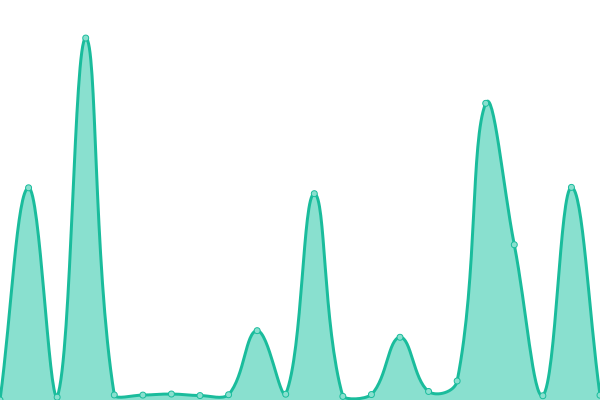
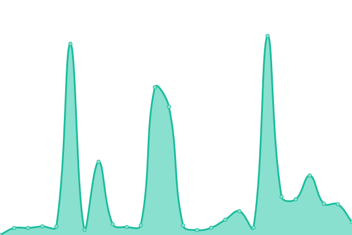
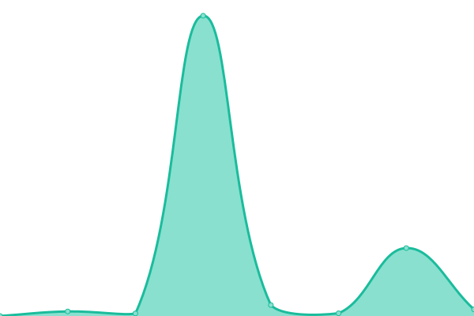

# [📈 Live Status](https://MrAmericanMike.github.io/funkytown): <!--live status--> **🟧 Partial outage**

This repository contains the open-source uptime monitor and status page for [MrAmericanMike](https://MrAmericanMike.github.io/funkytown), powered by [Upptime](https://github.com/upptime/upptime).

With [Upptime](https://upptime.js.org), you can get your own unlimited and free uptime monitor and status page, powered entirely by a GitHub repository. We use [Issues](https://github.com/MrAmericanMike/funkytown/issues) as incident reports, [Actions](https://github.com/MrAmericanMike/funkytown/actions) as uptime monitors, and [Pages](https://MrAmericanMike.github.io/funkytown) for the status page.

<!--start: status pages-->
<!-- This summary is generated by Upptime (https://github.com/upptime/upptime) -->
<!-- Do not edit this manually, your changes will be overwritten -->
<!-- prettier-ignore -->
| URL | Status | History | Response Time | Uptime |
| --- | ------ | ------- | ------------- | ------ |
|  [Twitch·MrAmericanBot·Replit](https://TwitchBot.mramericanmike.repl.co) | 🟩 Up | [twitch-mr-american-bot-replit.yml](https://github.com/MrAmericanMike/funkytown/commits/HEAD/history/twitch-mr-american-bot-replit.yml) | 

 1627ms
     
 | 

<a href="https://MrAmericanMike.github.io/funkytown/history/twitch-mr-american-bot-replit">97.04%</a>
    

|  [Discord·MrAmericanBot·Replit](https://DiscordBot.mramericanmike.repl.co) | 🟥 Down | [discord-mr-american-bot-replit.yml](https://github.com/MrAmericanMike/funkytown/commits/HEAD/history/discord-mr-american-bot-replit.yml) | 

 2027ms
     
 | 

<a href="https://MrAmericanMike.github.io/funkytown/history/discord-mr-american-bot-replit">96.81%</a>
    

|  [Discord·KoalaBot·Replit](https://KoalaBot.mramericanmike.repl.co) | 🟥 Down | [discord-koala-bot-replit.yml](https://github.com/MrAmericanMike/funkytown/commits/HEAD/history/discord-koala-bot-replit.yml) | 

 1339ms
     
 | 

<a href="https://MrAmericanMike.github.io/funkytown/history/discord-koala-bot-replit">90.53%</a>
    

|  [Discord·CityGuessinBot·Replit](https://CityGuessin.mramericanmike.repl.co) | 🟥 Down | [discord-city-guessin-bot-replit.yml](https://github.com/MrAmericanMike/funkytown/commits/HEAD/history/discord-city-guessin-bot-replit.yml) | 

 2376ms
     
 | 

<a href="https://MrAmericanMike.github.io/funkytown/history/discord-city-guessin-bot-replit">95.91%</a>
    

|  [Discord·GeoBottrAlokBot·Replit](https://GeoBottrAlok.mramericanmike.repl.co) | 🟥 Down | [discord-geo-bottr-alok-bot-replit.yml](https://github.com/MrAmericanMike/funkytown/commits/HEAD/history/discord-geo-bottr-alok-bot-replit.yml) | 

 2821ms
     
 | 

<a href="https://MrAmericanMike.github.io/funkytown/history/discord-geo-bottr-alok-bot-replit">96.99%</a>
    

|  [Discord·GeoBottr·Render](https://geobottr.onrender.com/) | 🟩 Up | [discord-geo-bottr-render.yml](https://github.com/MrAmericanMike/funkytown/commits/HEAD/history/discord-geo-bottr-render.yml) | 

 206ms
     
 | 

<a href="https://MrAmericanMike.github.io/funkytown/history/discord-geo-bottr-render">100.00%</a>
    

<!--end: status pages-->

[**Visit our status website →**](https://MrAmericanMike.github.io/funkytown)

## 📄 License

- Powered by: [Upptime](https://github.com/upptime/upptime)
- Code: [MIT](./LICENSE) © [MrAmericanMike](https://MrAmericanMike.github.io/funkytown)
- Data in the `./history` directory: [Open Database License](https://opendatacommons.org/licenses/odbl/1-0/)
